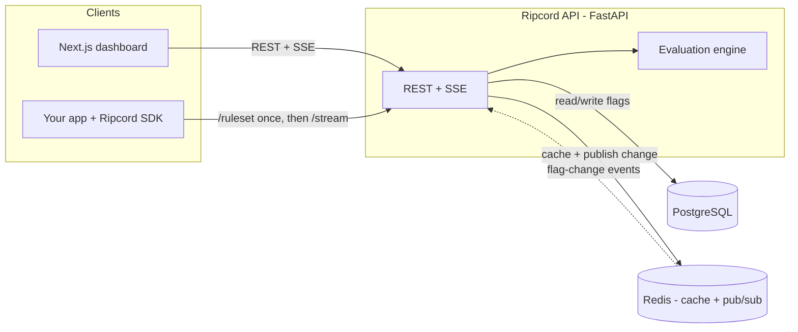

# Ripcord

[](https://github.com/samyak-1021/ripcord/actions/workflows/ci.yml)

A self-hostable **feature-flag & gradual-rollout service** — a LaunchDarkly-lite you
can run yourself. Toggle features on/off, target users by attributes, roll them out to
a percentage of traffic, and **pull the ripcord to kill a bad feature instantly** — no
redeploy.

> Shipping to 100% of users on day one is risky. Real teams release to 5% first, target
> by country/plan, watch the metrics, and kill anything that misbehaves — all without a
> code deploy. Ripcord is a small, honest version of exactly that.

<!-- Add a dashboard screenshot/GIF here — e.g. docs/dashboard.png -->

## Highlights

- **Sticky, monotonic percentage rollouts** — consistent-hash bucketing means a user
  never flip-flops, and raising the rollout only ever *adds* users.
- **Attribute targeting** — rule DSL (`in` / `not_in` / `eq` / `neq`) that overrides the rollout.
- **Instant kill switch** — disable a flag and it's off for everyone, immediately.
- **Real-time propagation** — a change is broadcast over Redis pub/sub and pushed to every
  client via **Server-Sent Events**, so updates land in <1s with no redeploy.
- **A Python SDK that evaluates locally** — fetches the ruleset once, evaluates in
  microseconds with no per-check network hop, auto-refreshes over SSE, and **fails open**.
- **Optimistic concurrency** — versioned updates reject lost writes with a `409`.
- **Observability + load-tested** — structured JSON logs, Prometheus `/metrics`, and a k6
  suite (~1,120 RPS, p99 ~108ms).

## Architecture



The **evaluation engine** is a pure, dependency-free module shared by the server *and* the
SDK, so client and server can never disagree. Order of precedence:

1. **Master switch off** → off for everyone (the kill switch).
2. **A matching targeting rule** → on (rules are allow-list overrides).
3. **Percentage rollout** by sticky bucket → on / off.

## API

| Method | Path | Purpose |
|---|---|---|
| `GET` | `/health` | Liveness probe |
| `POST` | `/flags` | Create a flag |
| `GET` | `/flags` | List all flags |
| `GET` | `/flags/{key}` | Get one flag |
| `PATCH` | `/flags/{key}` | Update a flag (version-checked, optimistic locking) |
| `DELETE` | `/flags/{key}` | Delete a flag |
| `POST` | `/evaluate` | Evaluate a flag for a user + context |
| `GET` | `/ruleset` | Full ruleset for SDK bootstrap (Redis-cached) |
| `GET` | `/stream` | SSE stream of `flag-change` events |
| `GET` | `/audit` | Recent change history (optional `?flag_key=`) |
| `GET` | `/stats` | Flag counts + evaluation totals |
| `GET` | `/metrics` | Prometheus metrics |

## Tech stack

| Area | Choice |
|---|---|
| API | FastAPI (async) + Pydantic v2 |
| Data | PostgreSQL + async SQLAlchemy 2.0 + Alembic |
| Cache / real-time | Redis (cache + pub/sub) + Server-Sent Events |
| SDK | Installable Python client (local evaluation, fail-open) |
| Dashboard | Next.js 16 + React + Tailwind CSS |
| Quality | pytest + testcontainers, Ruff, k6 |
| Ops | Docker, docker-compose, GitHub Actions CI, Terraform |

## Quickstart

**Everything in Docker** (API + Postgres + Redis):

```bash
docker compose up -d --build
curl localhost:8000/health
# -> {"status":"ok","service":"ripcord","version":"0.1.0"}
```

**Or run the API on the host** (deps in Docker):

```bash
docker compose up -d postgres redis
python3 -m venv .venv && source .venv/bin/activate
pip install -e ".[dev]"
alembic upgrade head
uvicorn ripcord.main:app --reload
```

**Dashboard:**

```bash
cd dashboard
npm install
NEXT_PUBLIC_API_URL=http://localhost:8000 npm run dev   # http://localhost:3000
```

## Using the SDK

The SDK loads the ruleset once and evaluates **locally** — no network call per check.

```python
from ripcord.sdk import RipcordClient

client = RipcordClient(base_url="http://localhost:8000")
await client.start()   # bootstrap the ruleset + watch for changes over SSE

# Evaluated in-process, in microseconds. Falls back to `default` if the flag
# is unknown or the service is unreachable (fail-open).
if client.is_enabled("new-checkout", user_id="u-123", context={"country": "IN"}):
    show_new_checkout()

await client.close()
```

## Observability

- **Structured logs** — one JSON object per line (`{"event":"flag.updated","key":"...","version":3,...}`).
- **Prometheus** — `GET /metrics` exposes request counts + latency and a custom
  `ripcord_flag_evaluations_total{result=...}` counter.

## Load test

`k6 run loadtest/evaluate.js` against the `/evaluate` endpoint (50 VUs, 20s) on a laptop:

| Metric | Result |
|---|---|
| Throughput | **~1,120 req/s** (22,438 requests) |
| Errors | **0%** |
| Latency p95 / p99 | **78 ms / 108 ms** |

`/evaluate` is the server path (a DB lookup per call). Apps use the **SDK**, whose local
path is microseconds with no network hop.

> Numbers are a single run on an M-series laptop — indicative, not a formal benchmark.

## Deployment

- **`docker compose up -d --build`** — the quick local stack.
- **Terraform** (`terraform/`) — the same stack as reproducible infra-as-code via the
  Docker provider (`terraform init && terraform apply`). See [terraform/README.md](terraform/README.md).

## Testing

```bash
pytest -q          # unit + integration (spins ephemeral Postgres/Redis via testcontainers)
ruff check .
```

> Requires a running Docker daemon — testcontainers spins ephemeral Postgres + Redis.

The evaluation engine has dedicated unit tests for determinism, **monotonicity**, and
rollout **distribution**; the API, SDK (incl. the SSE watch loop), and optimistic-locking
concurrency are covered by integration tests against a real database.

## Project structure

```
ripcord/
├── ripcord/            # FastAPI backend
│   ├── api/            # routers: flags, evaluate, realtime, insights, health
│   ├── engine.py       # pure evaluation engine (shared with the SDK)
│   ├── services.py     # flag CRUD + optimistic locking + audit log
│   ├── cache.py        # Redis ruleset cache + pub/sub
│   ├── metrics.py      # Prometheus instrumentation
│   └── sdk/            # installable Python client (local eval, fail-open)
├── dashboard/          # Next.js + Tailwind dashboard
├── migrations/         # Alembic migrations
├── loadtest/           # k6 load test
├── terraform/          # infra as code (Docker provider)
├── tests/              # pytest suite
├── Dockerfile          # backend image
└── docker-compose.yml  # full local stack
```

## Limitations / what I'd improve

- **Auth** — the management API is currently open; a real deployment needs API keys / RBAC.
- **`/evaluate` reads the DB per call.** It could read the Redis ruleset cache; the intended
  production path is the local-evaluating SDK anyway.
- **Whole-ruleset cache invalidation** — simple and correct, but per-flag keys would scale better.
- **Multivariate flags** — only boolean flags today; the data model leaves room for variants.

## License

[MIT](LICENSE)
